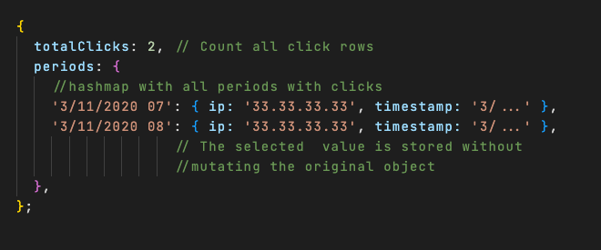
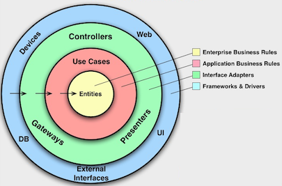
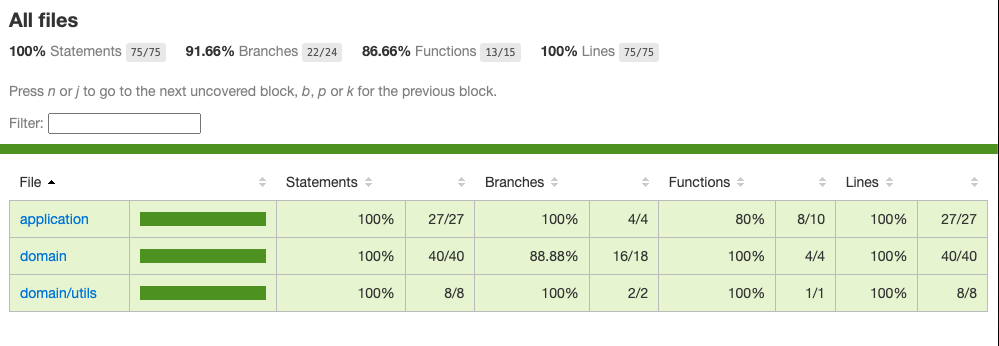

# Filtering code challenge


# 1.  Requirements 🧾
Given an array of clicks, return the subset of clicks where:
1. For each IP within each one hour period, only the most expensive click is placed into the
result set.
2. If more than one click from the same IP ties for the most expensive click in a one hour
period, only place the earliest click into the result set.
3. If there are more than 10 clicks for an IP in the overall array of clicks, do not include any
of those clicks in the result set.


The result set should be stored in an array of objects. Each object should represent a click. The
expected result set should be a subset of the original array.


# 2.  Assumptions  🧐
- We assume that the array of clicks might not be ordered by timestamp ( Information given by Gartner)
- The timestamp format is always in the same format. Invalid timestamps are not considered.
- The command should be called with ```npm run solution```. As no arguments present, we assume that the input file is fixed (root of the project) and also the output (named resultset.json as required by the assessment)

- As the input might not be ordered, also the output might not be ordered by timestamp because is not a requisite. I assumed that and I did not order the output because performance is better in that way for my solution. If order is required we could implement it once the data is filtered.

- I didn't validate invalid dates like 2017-01-32 56:00:00 I only validate that the date respect the string format proposed.I could add some moment validation but it should decrease the performance of the algorithm.

# 3. Coding the solution 💻

I decided work without any external library. I used the native nodejs fs library to read/write the file and i implement a simple date parser for the proposed timestamp.
I only added libraries for testing and linting.

To implement the solution, once the data has been loaded, through an iteration I process each of the different records. 
The main idea is to classify by IP all the clicks. Once classified, we can discard or select those that match according  requirements.
Once classified, we extract only the resulting data and save them again in a file.

Here an example of the data-structure selected:


With this structure, each time that we have a new item for that IP, we can compare the amount and decide if we have to add or update some value.


# 3. Architecture 🏗️
I decided to apply kind of hexagonal Architecture pattern. It is not fully implemented because i don't consider necessary but it's a good approach to separate the business logic from the rest of the code.

I split the code in 2 layers: 
- Domain: where the business logic is implemented
- Application: All logic related with communications, inputs, outputs..
I also used the Repository pattern to abstract the data access. In this case, the data is stored in a file, but we could change the implementation to get the data from a http request or a database.

As hexagonal architecture principles says, the domain layer should not depend on the application layer.


# 4. Testing & linting
I did some unit testing to check the main functionalities. I used Jest as testing framework.
I get almost a 100% coverage on the code:

You can check it executing ```npm run test``` and open the coverage/index.html file


I also added eslint to verify the code quality and consistence.


# 5. Performance ⚡️

I did a small script to simulate how the algorithm performs with a hughe amount of data. I used 4 Million records that occupies about 270MB.
You can review the script in the ./scripts folder.

In my example it performs in 300ms ( the processing part) but it has a trick, in my script every ip has more than 10 clicks and this limits the total operations..
If i remove the limit 10 clicks by ip condition it tooks about 2.5 seconds that is pretty good for processing 270MB.

I also spent a few time trying to optimize the date related functions like:

### Substring vs concatenating strings for generate the period

With 1 million
Replace: 480 ms
Regex: 445 ms

### Regex or split for generate a ```new Date()```
Regex vs Split + replace

SPLIT + Replace:  815 ms
Regex:  445 ms

This optimizations doesn't have a big impact in the performance but it is good to know that we can improve the performance in that way.


#6. Installation 🚀

installation:
    ```
     npm install
    ```

execute:
    ```
     npm run solution
    ```

test:
    ```
     npm run test
    ```


